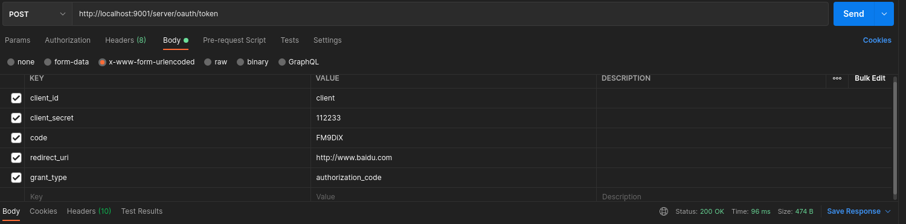
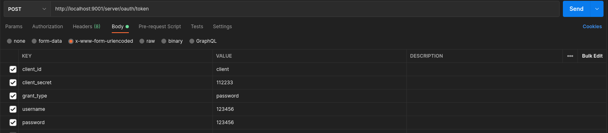
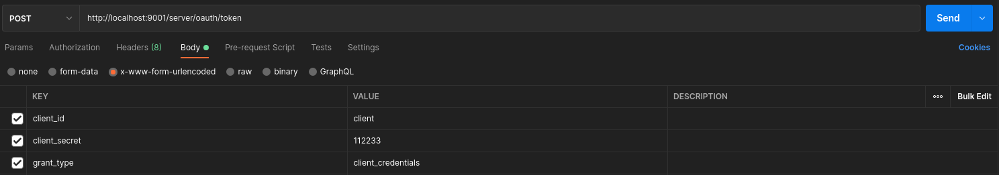
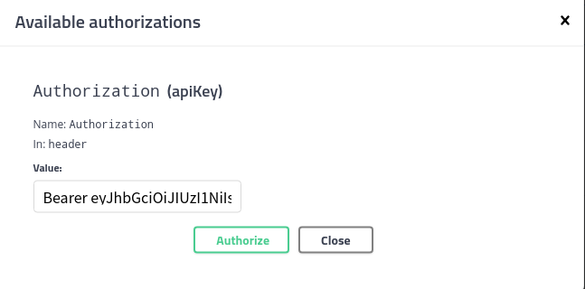

为了方便理解，聚合项目只作为容器，不做其他作用，授权服务器和资源服务器可以单独拿出来打包部署，实际情况也是单独部署

授权码模式 第三方介入 如微信授权案例
Method GET
http://localhost:9001/server/oauth/authorize?client_id=client&response_type=code&scope=all&redirect_uri=http://www.baidu.com
获取授权码去拿token
Method POST
http://localhost:9001/server/oauth/token

简化模式
Method GET
http://localhost:9001/server/oauth/authorize?client_id=client&response_type=token&scope=all&redirect_uri=http://www.baidu.com

密码模式 客户端属于自己的app
Method POST
http://localhost:9001/server/oauth/token

客户端模式 完全信任客户端的时候使用  企业每部应用比较适用
Method POST
http://localhost:9001/server/oauth/token

client info sql
//客户端详情建表sql 脚本
create table oauth_client_details
(
client_id               varchar(128)  not null comment '客户端ID'
primary key,
resource_ids            varchar(256)  null comment '资源ID集合，多个资源时用英文逗号分隔',
client_secret           varchar(256)  null comment '客户端密匙',
scope                   varchar(256)  null comment '客户端申请的权限范围',
authorized_grant_types  varchar(256)  null comment '客户端支持的grant_type 注：带有刷新令牌的要带上refresh_token',
web_server_redirect_uri varchar(256)  null comment '重定向URI',
authorities             varchar(256)  null comment '客户端所拥有的SpringSecurity的权限值，多个用英文逗号分隔',
access_token_validity   int           null comment '访问令牌有效时间值(单位秒)',
refresh_token_validity  int           null comment '更新令牌有效时间值(单位秒)',
additional_information  varchar(4096) null comment '预留字段',
autoapprove             varchar(256)  null comment '用户是否自动Approval操作'
)
comment '客户端信息' charset = utf8;

授权码存储表sql

create table oauth_code
(
code           varchar(256) null comment '授权码(未加密)',
authentication blob         null comment 'AuthorizationRequestHolder.java对象序列化后的二进制数据'
)
comment '授权码' charset = utf8;

集成swagger 的时候
在swagger的认证页面添加token的时候 前边加上 Bearer 
